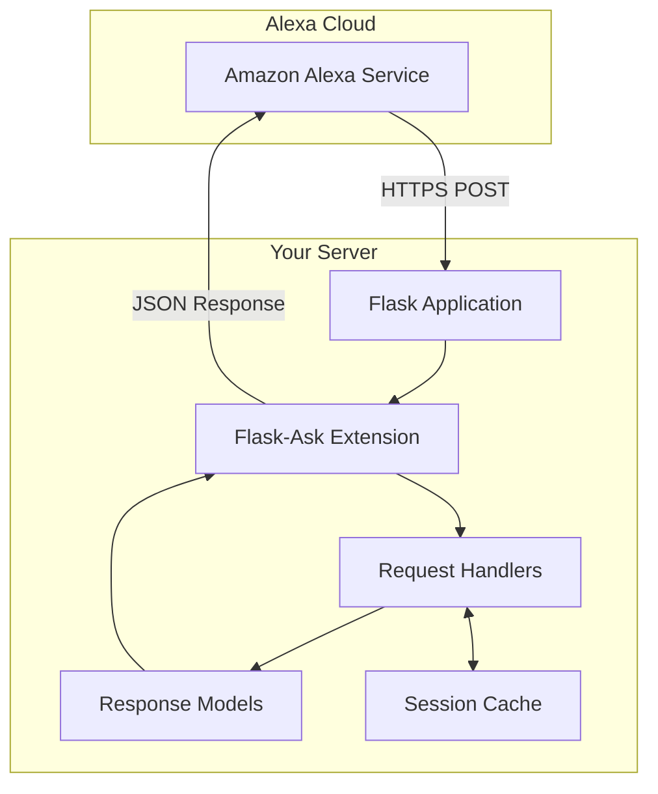
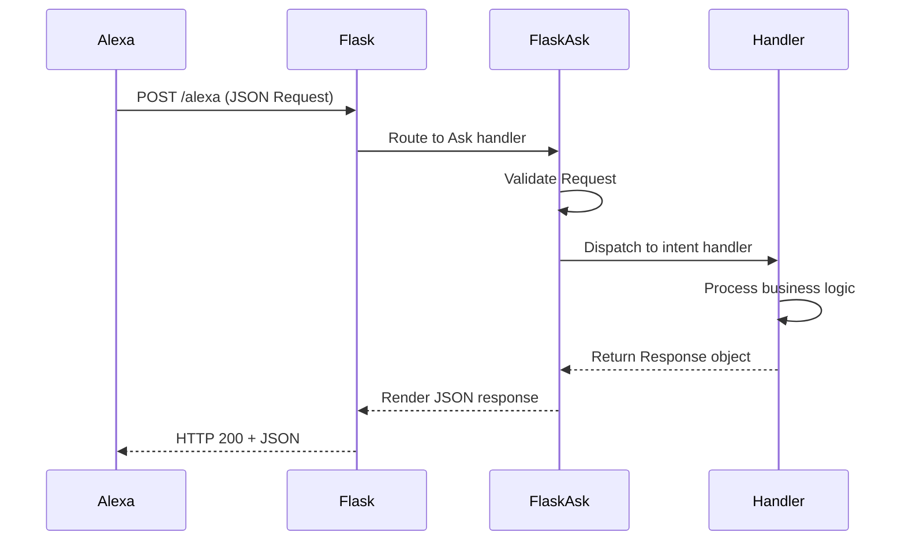

# Architecture Documentation

This directory contains high-level architectural diagrams and system design documentation for Flask-Ask.

## Purpose

Architecture documentation provides:

- **Visual Understanding**: Mermaid.js diagrams for system components
- **Component Overview**: How different parts of the system interact
- **Design Patterns**: Patterns and conventions used throughout the codebase
- **Integration Points**: How Flask-Ask integrates with Flask and Alexa APIs

## Flask-Ask System Overview

## Core Components

### Request Flow

### Component Structure

| Component | File | Purpose |
|-----------|------|---------|
| Core | `flask_ask/core.py` | Main Ask class and request handling |
| Models | `flask_ask/models.py` | Response builders (statement, question, audio) |
| Cache | `flask_ask/cache.py` | Session and stream caching |
| Verifier | `flask_ask/verifier.py` | Alexa request verification |
| Convert | `flask_ask/convert.py` | Type conversion utilities |

## Design Patterns

1. **Decorator-based Routing**: Intent handlers are registered via decorators
2. **Builder Pattern**: Response objects use fluent interface for chaining
3. **Context Locals**: Request/session data via Flask-style context locals

## Diagrams

Additional architectural diagrams should be placed in this directory with descriptive filenames:

- `request-lifecycle.md` - Detailed request processing
- `audio-player.md` - AudioPlayer directive handling
- `dialog-management.md` - Dialog delegation flow

---

*Note: Keep diagrams updated when architectural changes are made.*
